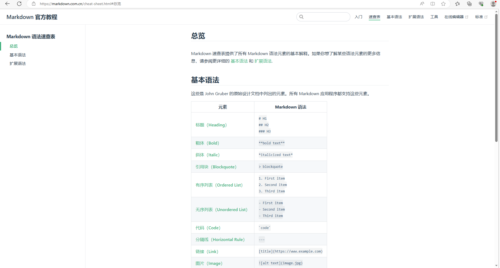

# 该仓库为电子设计大赛专用仓库

	
	<h2>2023 电赛兼自动化学习仓库</h2>
	

		
	

    

#### 其实也是学习用的啦~

> Note that since DEV_C++ can only read GB2312, all encoding modes in this document are GB2312, not UTF-8 (default)
> So when opening this folder with vscode after downloading the ZIP, **remember to toggle 'encoding' to 'GB2312'.**

> 注意，由于 DEV_C++只能读取 GB2312 的关系，本文档所有的编码模式都是 GB2312，而不是 UTF-8（默认）
> 所以**下载 ZIP 后**使用 vscode 打开本文件夹时，记得**切换'encoding'为"GB2312"**。  
> 
>
> > **设置步骤**
> >
> > 1. 进入左下角，点开设置（如图）
> >    
> > 2. 点击“设置”
> >    
> > 3. 在搜索栏输入“encoding”
> >    
> > 4. 在“filem encoding”里面选择“GB2312” _结果如图所示_ >>

## 目录

1. 单片机存档
   > 将单片机的整个工程文件打包放置到这个文件夹下面。
   >
   > > **注意** >>**压缩包整个下下来请自行创建工程文件在自己弄**

---

2. C 语言学习
   > C 语言学习的存档

- 文件名 || 知识点
- [learn v1.0](./C语言学习/learn%20v1.0.c) || 1.结构 2.转义字符
- [learn v1.1](./C语言学习/learn%20v1.1.c) || 1.常量 2.基本类型 3.通配对应
- [learn v1.2](./C语言学习/learn%20v1.2.c) || 1.标识符：sizeof 2.字符/字符串/ASCII 码。
- [learn v1.3](./C语言学习/learn%20v1.3.c) || 1.字符串的各类函数
- [learn v1.4](./C语言学习/learn%20v1.3.c) || 1.算数运算符
- [learn v2.0](./C语言学习/learn%20v1.4.c) || 1.关系运算符
---

## learn v2.1(1-3) || 算法课，对最重要的条件判断等内容进行讲解

- [learn v3.0](./C语言学习/learn%20v3.0.c) || 1.数组
- [learn v3.1](./C语言学习/learn%20v3.1.c) || 1.字符串的各类函数
- [learn v3.2](./C语言学习/learn%20v3.2.c) || 1.二维数组
- [learn v3.3](./C语言学习/learn%20v3.3.c) || 控制台中的输入输出
- [learn v4.0](./C语言学习/learn%20v4.0.c) || 1.函数入门
- [learn v4.1](./C语言学习/learn%20v4.1.c) || 1.函数的嵌套调用：在C语言中的函数在层级上
- [learn v5.0](./C语言学习/learn%20v5.0.c) || 1.指针  
  **未完待续**

---

Object 文件夹

- 小甲鱼的代码----这个是用 C 来写的，统计一共敲多少代码的程序
- 质数的判断 ----华凯
- 存放成绩（数组）------这个是利用数组的特性 i 写的一个小案例
- 等差数列计算 —————— 这是跟函数（4.0 配套使用的），用来计算 1 加到他自己的函数。
- 冒泡排序 

DLC

[类型符.txt](./C语言学习/类型符.txt)**通配符不会写？看这个就对了！**  
[scanf()用法.md](<./C语言学习/scanf()用法.md>) || 关于 scanf()函数用法的一些小技巧

---

3. git 版本管理.txt/mackdown 学习样本.md

   > git 操作的说明，一些实用的小技巧

4. README.md
   你看的这个东西就是了 _没事来这里找找_

5. 草稿  
   **这里面放的是一些杂七杂八的东西，随时删除的那种，不再在本 README.md 上更新**

6. 奇奇怪怪的小技巧
   此处是一些readme文档的集合地，其中是不少可能用不到但是没有又很伤的文件。

7. **朱正阳期末作业**
   实名上网第一人（bushi）

---

## 小贴士

1. [改默认编码](https://blog.csdn.net/u012308586/article/details/98201989)
   

## 资料来源

### 点链接可以直接点进去看，图片的来源在 img 文件夹中。

1. [**git 教程（没看完就别乱动）**](https://www.runoob.com/git/git-tutorial.html)
   
   [**git 官方链接**](https://git-scm.com/book/zh/v2/%E8%B5%B7%E6%AD%A5-%E5%AE%89%E8%A3%85-Git)

2. [c 语言中文网————转义字符](http://c.biancheng.net/view/1769.html)
   

3. [mackdown 中文官方教程](https://markdown.com.cn/cheat-sheet.html#%E5%9F%BA%E6%9C%AC%E8%AF%AD%E6%B3%95)
   

4. [菜鸟教程————C 语言](https://www.runoob.com/cprogramming/c-tutorial.html)
   

5. [studio.h 库](https://www.runoob.com/cprogramming/c-standard-library-stdio-h.html)
   

6. [math.h 库](https://www.runoob.com/cprogramming/c-standard-library-math-h.html)
   

7. [微软教程](https://learn.microsoft.com/zh-cn/cpp/preprocessor/hash-if-hash-elif-hash-else-and-hash-endif-directives-c-cpp?view=msvc-170)
   

---

## 贡献名单

1. **_Ender_Zhu（其实就是我啦）_**
2. **华凯**
   欢迎大家加入。

###### 电赛后记

今年夏天的成果到此为止(v0.0.32)

讲点题外话，ender zhu,当你过 5 年再来看你这个夏天放弃了半个暑假的时间来看搞得这个比赛，你会抱着怎样的心情呢？

这 204 的 2 号机，到底见证了你什么呢？夏虫不可语冰，你这小半个月的努力，到底带来了什么呢？

当然，祝你一切安好 date:2023-07-29.
