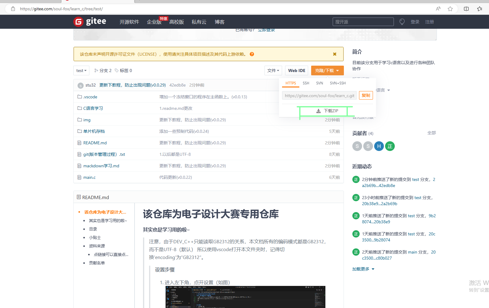
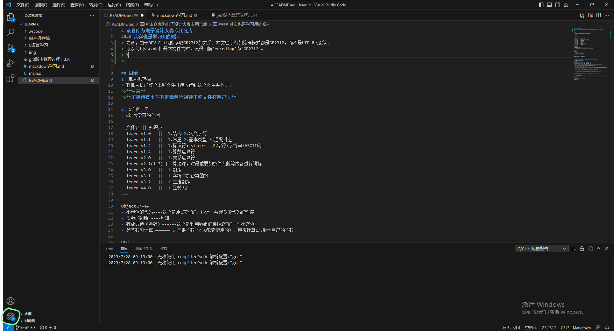
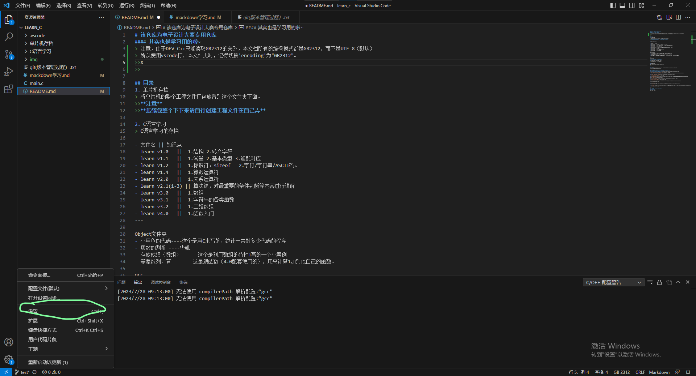
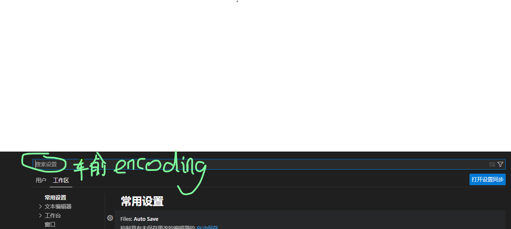
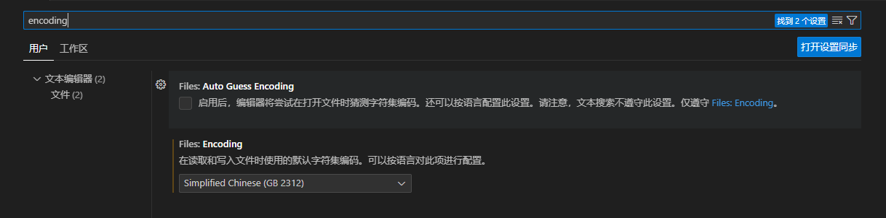
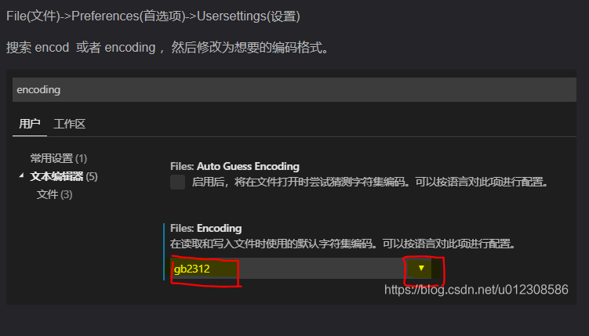
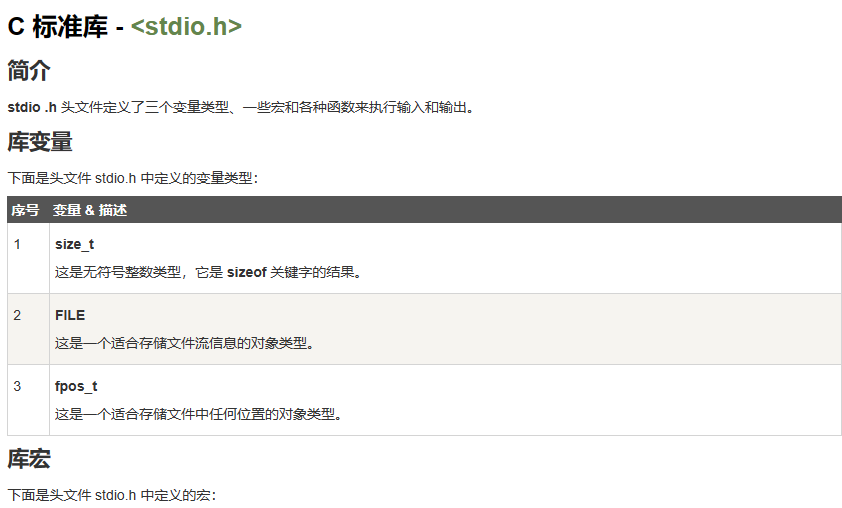
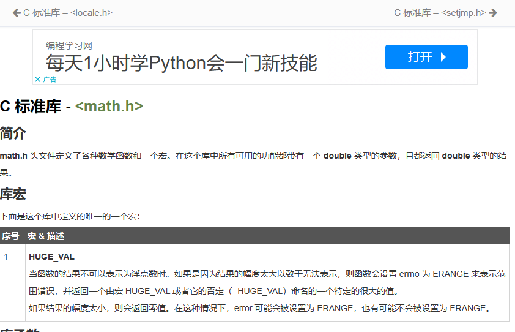
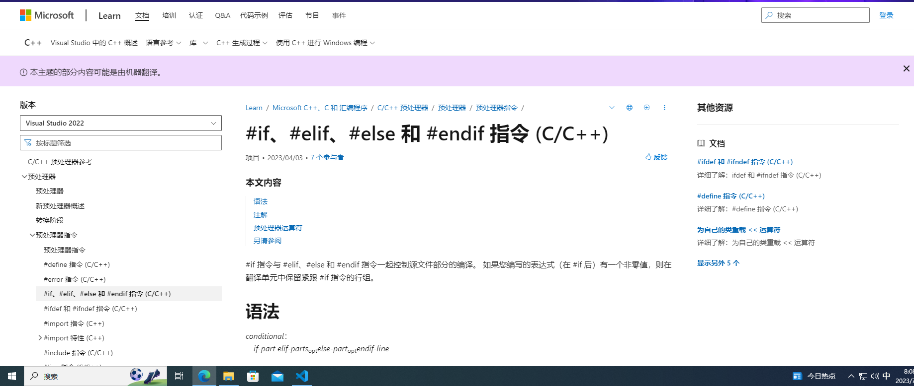

# 该仓库为电子设计大赛专用仓库
#### 其实也是学习用的啦~
> 注意，由于DEV_C++只能读取GB2312的关系，本文档所有的编码模式都是GB2312，而不是UTF-8（默认）
> 所以**下载ZIP后**使用vscode打开本文件夹时，记得切换'encoding'为"GB2312"。  
> 
>>**设置步骤**
>>1. 进入左下角，点开设置（如图）
>>
>>2. 点击“设置”
>>
>>3. 在搜索栏输入“encoding”
>>
>>4. 在“filem encoding”里面选择“GB2312”  _结果如图所示_
>>

## 目录
1. 单片机存档
> 将单片机的整个工程文件打包放置到这个文件夹下面。
>>**注意**
>>**压缩包整个下下来请自行创建工程文件在自己弄**

---

2. C语言学习
> C语言学习的存档

- 文件名 || 知识点
- learn v1.0-  ||  1.结构 2.转义字符
- learn v1.1   ||  1.常量 2.基本类型 3.通配对应
- learn v1.2   ||  1.标识符：sizeof   2.字符/字符串/ASCII码。
- learn v1.4   ||  1.算数运算符
- learn v2.0   ||  1.关系运算符
- learn v2.1(1-3) || 算法课，对最重要的条件判断等内容进行讲解
- learn v3.0   ||  1.数组
- learn v3.1   ||  1.字符串的各类函数
- learn v3.2   ||  1.二维数组
- learn v4.0   ||  1.函数入门
---

Object文件夹
- 小甲鱼的代码----这个是用C来写的，统计一共敲多少代码的程序
- 质数的判断 ----华凯
- 存放成绩（数组）------这个是利用数组的特性i写的一个小案例
- 等差数列计算 ―――――― 这是跟函数（4.0配套使用的），用来计算1加到他自己的函数。 

DLC

类型符.txt  
**通配符不会写？看这个就对了！**
---
3. git版本管理.txt/git学习样本.md
>git操作的说明，一些实用的小技巧

4. README.md
你看的这个东西就是了 _没事来这里找找_
---

## 小贴士
1. [改默认编码](https://blog.csdn.net/u012308586/article/details/98201989)

## 资料来源
### 点链接可以直接点进去看，图片的来源在img文件夹中。
1. [**git教程（没看完就别乱动）**](https://www.runoob.com/git/git-tutorial.html)

 [**git官方链接**](https://git-scm.com/book/zh/v2/%E8%B5%B7%E6%AD%A5-%E5%AE%89%E8%A3%85-Git) 

2. [c语言中文网――――转义字符](http://c.biancheng.net/view/1769.html)

3. [mackdown中文官方教程](https://markdown.com.cn/cheat-sheet.html#%E5%9F%BA%E6%9C%AC%E8%AF%AD%E6%B3%95)
！[md基础操作](./img/md中文网.png)

4. [菜鸟教程――――C语言](https://www.runoob.com/cprogramming/c-tutorial.html)

5. [studio.h库](https://www.runoob.com/cprogramming/c-standard-library-stdio-h.html)

6. [math.h库](https://www.runoob.com/cprogramming/c-standard-library-math-h.html)

7. [微软教程](https://learn.microsoft.com/zh-cn/cpp/preprocessor/hash-if-hash-elif-hash-else-and-hash-endif-directives-c-cpp?view=msvc-170)

---
## 贡献名单
1. __*Ender_Zhu（其实就是我啦）*__
2. **华凯**
欢迎大家加入。