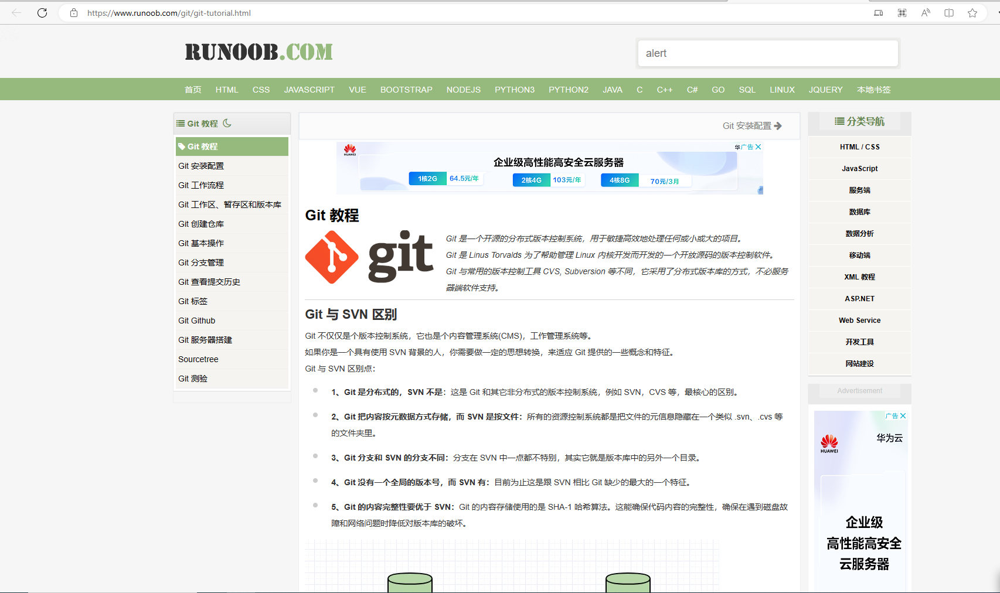

# 该仓库为电子设计大赛专用仓库
#### 其实也是学习用的啦~

## 目录
1. 单片机存档
> 将单片机的整个工程文件打包放置到这个文件夹下面。
>>**注意**
>>**压缩包整个下下来请自行创建工程文件在自己弄**

2. C语言学习
> C语言学习的存档

- 文件名 || 知识点
---
- learn v1.0-  ||  1.结构 2.转义字符
- learn v1.1   ||  1.常量 2.基本类型 3.通配对应
- learn v1.2   ||  1.标识符：sizeof   2.字符/字符串/ASCII码。

DLC
- 小甲鱼的代码----这个是用C来写的，统计一共敲多少代码的程序

3. git版本管理.txt/git学习样本.md
>git操作的说明，一些实用的小技巧

4. README.md
你看的这个东西就是了

## 资料来源
### 点链接可以直接点进去看，图片的来源在img文件夹中。
1. [**git教程（没看完就别乱动）**](https://www.runoob.com/git/git-tutorial.html)

 [**git官方链接**](https://git-scm.com/book/zh/v2/%E8%B5%B7%E6%AD%A5-%E5%AE%89%E8%A3%85-Git) 

2. [c语言中文网————转义字符](http://c.biancheng.net/view/1769.html)

3. [mackdown中文官方教程](https://markdown.com.cn/cheat-sheet.html#%E5%9F%BA%E6%9C%AC%E8%AF%AD%E6%B3%95)
！[md基础操作](./img/md中文网.png)

4. [菜鸟教程————C语言](https://www.runoob.com/cprogramming/c-tutorial.html)

## 贡献名单
1. __*Ender_Zhu（其实就是我啦）*__

欢迎大家加入。